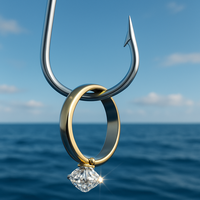

# 🐟 Fishing Game Fish Catalog

A visual/reference catalog of all fish and items currently configured in the fishing mini‑game.

> Source of truth is `my_fishing_game_config.json`. This page is generated/maintained manually; update it after adding/removing fish or changing rarities.

## Legend
- **Rarity Order (rarest → most common):** Mythic → Ultra-Legendary → Legendary → Epic → Rare → Uncommon → Common → Junk
- **Image Match Rule:** Image filename must match the fish name exactly (case-insensitive) with allowed extensions: `.png`, `.jpg`, `.jpeg`, `.gif`.

---
## Mythic
| Image | Name | Notes |
|-------|------|-------|
|  | Helios-Sunfish | Blazes with a corona when landed. |

## Ultra-Legendary
| Image | Name | Notes |
|-------|------|-------|
|  | Diamond-Ring | Lost treasure; massive point potential. |

## Legendary
| Image | Name | Notes |
|-------|------|-------|
|  | Blue-Whale | Largest creature. |
|  | Clockwork-Carp | Mechanical mystery. |

## Epic
| Image | Name | Notes |
|-------|------|-------|
|  | Great-White-Shark | Apex predator. |
|  | Hammerhead-Shark | Wide head sensory boost. |
|  | Narwhal | Unicorn of the sea. |
|  | Lavender-Braid-Eel | Shimmering violet ribbon. |
|  | DevOps-Ducky | Silently debugs you. |

## Rare
| Image | Name | Notes |
|-------|------|-------|
|  | Barracuda | Fast strike hunter. |
|  | Mahi-Mahi | Acrobatic golden fighter. |
|  | Marlin | Trophy billfish. |
|  | Sailfish | Fastest fish. |
|  | Tarpon | Silver King. |
|  | Wahoo | Razor speed. |
|  | Starfall-Salmon | Meteor-shower scales. |

## Uncommon
| Image | Name | Notes |
|-------|------|-------|
|  | Sea-Bass | Versatile predator. |
|  | Smallmouth-Bass | Aerial fighter. |
|  | Bonefish | Gray ghost. |
|  | Comfy-Catfish | Purrs when held. |
|  | Tuna | Endurance swimmer. |

## Common
| Image | Name | Notes |
|-------|------|-------|
|  | Blue-Tang | Friendly reef fish. |
|  | Butterfly-fish | Patterned beauty. |
|  | Clown-Fish | Anemone companion. |
|  | Crab | Sideways scuttler. |
|  | Lobster | Prized delicacy. |
|  | Parrot-Fish | Sand maker. |
|  | Perch | Freshwater striped. |
|  | Sea-Cucumber | Regenerative oddity. |
|  | Seahorse | Male broods young. |
|  | Shrimp | Vital link species. |
|  | Starfish | Regrows limbs. |
|  | Sea-Urchin | Reef balancer. |
|  | Button-Shield-Minnow | Tiny & collectible. |
|  | Tangled-Headset | +5 comedy. |

## Junk
| Image | Name | Notes |
|-------|------|-------|
|  | Stinky-Boot | Putrid footwear. |
|  | Worn-Trainers | Ancient sneakers. |

---
## Special / Non-Fish
| Image | Token | Notes |
|-------|-------|-------|
|  | No Catch | Shown when nothing bites (consolation message). |

> Member catches use the caught user's Discord avatar (no static asset file).

---
### Maintenance Checklist
- [ ] After adding a fish via `!addfish`, add row here.
- [ ] Ensure image dropped into `FishingGameAssets/`.
- [ ] Keep rarity group sections in rarity order.
- [ ] When renaming a fish: update config JSON, asset filename, and this catalog.

*Generated manually – update as part of release notes when fish set changes.*
